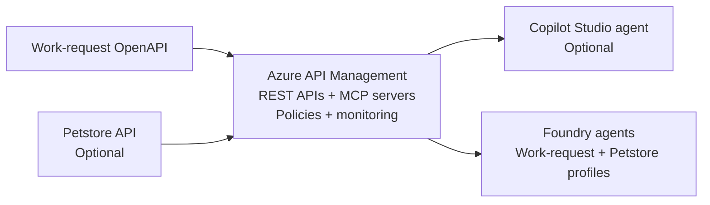

# Foundry, APIM, and MCP Workshop

A public workshop scaffold for turning an existing REST API into governed tools for AI agents.

The lab uses a synthetic work-request API, Azure API Management, Model Context Protocol, Microsoft Foundry, Microsoft Agent Framework, and an optional Copilot Studio path. It does not require organization data or access to organization systems.

## What participants build



## Repository contents

- `WORKSHOP.md`: Workshop preparation, schedule, and lab navigation.
- [Workshop presentation](docs/foundry-apim-mcp-workshop.pptx): End-to-end
  facilitator deck covering the workshop phases, architecture, labs, governance,
  deployment, and production adaptation.
- `docs/labs/`: Step-by-step instructions for Labs 0 through 6.
- `openapi/work-request-api.yaml`: Synthetic API contract.
- `policies/`: APIM policy examples for mock responses, anonymous governance,
  and optional delegated Entra authentication.
- `src/Workshop.Agent/`: Current .NET hosted-agent starter.
- `src/Workshop.Agent/.env.example`: Work-request MCP agent configuration.
- `src/Workshop.Agent/.env.petstore.example`: Optional read-only Petstore MCP
  agent configuration.
- `src/Workshop.Agent/.agentignore`: Deployment-package exclusions for local
  credentials, build output, and generated state.
- `docs/architecture.md`: Reference architecture and design notes.
- `docs/prerequisites.md`: Environment and access checklist.
- `docs/facilitator-guide.md`: Timing, checkpoints, and recovery paths.
- `docs/azd-hosted-agent-deployment.md`: Advanced facilitator setup for
  command-line hosted-agent deployment.
- `docs/entra-delegated-oauth.md`: Optional delegated OAuth setup and MCP
  Inspector testing guidance.
- `scripts/verify-prereqs.ps1`: Local prerequisite checks.

## Quick start

1. Review [prerequisites](docs/prerequisites.md).
2. Run the local checks:

   ```powershell
   .\scripts\verify-prereqs.ps1
   ```

3. Follow [WORKSHOP.md](WORKSHOP.md).

## Current implementation choices

- .NET 10.
- Microsoft Agent Framework hosted-agent pattern.
- Auth: `AzureCliCredential` locally; `DefaultAzureCredential` when hosted.
- APIM Streamable HTTP MCP endpoint.
- Environment-configured MCP tool allowlists and approval boundaries.
- Separate hosted-agent profiles for the synthetic work-request and optional
  read-only Petstore MCP servers.
- Synthetic data and APIM mock policies for a safe sandbox.

## References

- [Expose a REST API as an MCP server in Azure API Management](https://learn.microsoft.com/azure/api-management/export-rest-mcp-server)
- [MCP servers in Azure API Management](https://learn.microsoft.com/azure/api-management/mcp-server-overview)
- [Microsoft Foundry SDK overview](https://learn.microsoft.com/azure/foundry/how-to/develop/sdk-overview)
- [Microsoft Agent Framework](https://github.com/microsoft/agent-framework)
- [Foundry hosted-agent MCP sample](https://github.com/microsoft-foundry/foundry-samples/tree/main/samples/csharp/hosted-agents/agent-framework/mcp-tools)

## License

MIT
