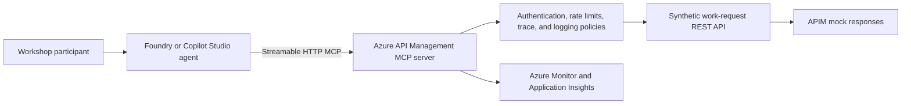

# Reference Architecture

## Responsibilities

| Layer | Responsibility |
|---|---|
| Agent | Intent interpretation, tool selection, response composition, and approval experience |
| MCP | Standard tool discovery and invocation protocol |
| APIM | Central gateway, tool exposure, authentication, policy enforcement, monitoring, and scale |
| REST API | Business operation contract and validation |
| Identity | User or workload authentication and authorization |
| Monitoring | Request correlation, latency, failures, usage, and audit evidence |

## Production adaptation

The workshop uses APIM mock responses. A production design would replace them with approved backends and add:

- Backend authentication.
- Business authorization.
- Human approval for material state changes.
- Idempotency and retry handling.
- Data classification and retention controls.
- Environment promotion and versioning.
- Service-level objectives and support ownership.

## Current platform notes

- APIM remote MCP endpoints use Streamable HTTP and normally end in `/mcp`.
- APIM supports MCP tools. It does not currently expose MCP resources or prompts from a managed REST API.
- APIM MCP capabilities are not supported in APIM workspaces.
- Response-body access in APIM MCP policies can break streaming.
