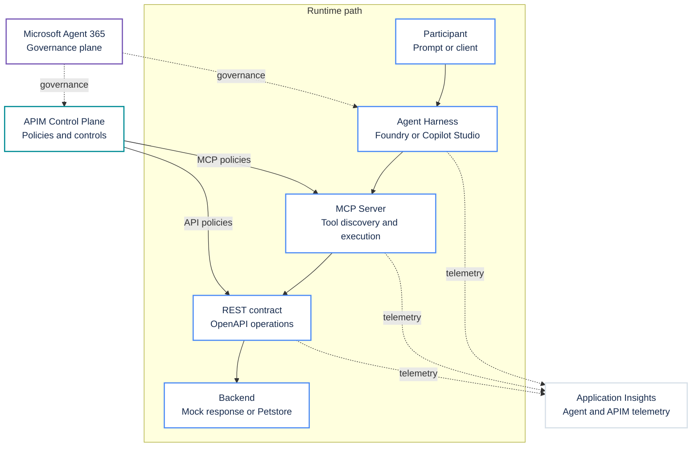

# Reference Architecture

The governance and observability layers intentionally overlap the runtime path:

- **Microsoft Agent 365** spans the Agent Harness and MCP Server. It provides
  enterprise inventory, identity, ownership, lifecycle, security, and
  compliance governance. It also governs the APIM control plane. Agent 365 is
  part of the production architecture and is not required to complete the labs.
- **APIM Control Plane** spans the MCP Server and REST contract. It applies
  authentication, rate limits, correlation, tracing, logging, and request
  controls without becoming an extra step in the runtime sequence.
- **Application Insights** spans the Agent Harness, MCP Server, and REST
  contract. The Agent Harness and APIM boundary emit correlated telemetry into
  one observability layer. The MCP Server and REST contract arrows represent
  gateway observations at those boundaries.

## Workshop profiles

| Profile | APIM path | Backend | Tool behavior |
|---|---|---|---|
| Work request | Managed REST contract exposed through the MCP Server | Static OpenAPI examples returned by APIM `mock-response` | Read tool is automatic; create and update tools require Agent Harness approval |
| Petstore (optional) | Separate managed REST contract exposed through the MCP Server | Public Swagger Petstore service | Read-only tools are automatic |

Both profiles use the same .NET Agent Harness implementation. Environment
variables select the APIM MCP endpoint, tool allowlist, approval boundary, agent
name, and description. The agent connects to one profile at a time during local
testing. The hosted deployment manifest can deploy separate work-request and
Petstore agents from the shared source.

## Responsibilities

| Layer | Responsibility |
|---|---|
| Microsoft Agent 365 | Enterprise agent inventory, identity, ownership, lifecycle, security, and compliance governance |
| Agent Harness | Intent interpretation, tool selection, response composition, and approval experience |
| MCP Server | Standard tool discovery and invocation protocol |
| APIM Control Plane | Central gateway configuration, tool exposure, authentication, rate limits, policy enforcement, correlation, tracing, logging, and scale |
| REST contract | OpenAPI operation contract, request validation, and backend routing or mock behavior |
| Identity | User or workload authentication and authorization |
| Application Insights | Correlated agent and APIM telemetry for latency, failures, usage, and audit evidence |

## Production adaptation

The primary workshop path uses APIM mock responses. The optional Petstore path
uses an uncontrolled third-party test service. Neither is a production backend.
A production design would replace them with approved services and add:

- Backend authentication.
- Business authorization.
- Human approval for material state changes.
- Idempotency and retry handling.
- Data classification and retention controls.
- Environment promotion and versioning.
- Service-level objectives and support ownership.

## Current platform notes

- APIM remote MCP endpoints use Streamable HTTP and normally end in `/mcp`.
- APIM supports MCP tools. It does not currently expose MCP resources or prompts from a managed REST API.
- APIM MCP capabilities are not supported in APIM workspaces.
- Response-body access in APIM MCP policies can break streaming.
