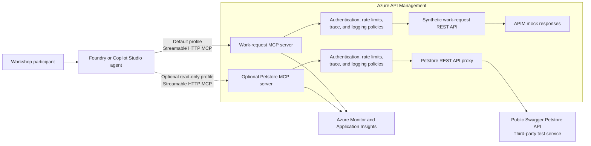

# Reference Architecture

## Workshop profiles

| Profile | APIM path | Backend | Tool behavior |
|---|---|---|---|
| Work request | Managed REST API exposed as the work-request MCP server | Static OpenAPI examples returned by APIM `mock-response` | Read tool is automatic; create and update tools require approval |
| Petstore (optional) | Separate managed REST API exposed as the Petstore MCP server | Public Swagger Petstore service | Read-only tools are automatic |

Both profiles use the same .NET agent application. Environment variables select
the APIM MCP endpoint, tool allowlist, approval boundary, agent name, and
description. The agent connects to one profile at a time during local testing.
The hosted deployment manifest can deploy separate work-request and Petstore
agents from the shared source.

## Responsibilities

| Layer | Responsibility |
|---|---|
| Agent | Intent interpretation, tool selection, response composition, and approval experience |
| MCP | Standard tool discovery and invocation protocol |
| APIM | Central gateway, tool exposure, authentication, policy enforcement, monitoring, and scale |
| REST API | Business operation contract, request validation, and backend routing or mock behavior |
| Identity | User or workload authentication and authorization |
| Monitoring | Request correlation, latency, failures, usage, and audit evidence |

## Production adaptation

The primary workshop path uses APIM mock responses. The optional Petstore path
uses an uncontrolled third-party test service. Neither is a production backend.
A production design would replace them with approved services and add:

- Backend authentication.
- Business authorization.
- Human approval for material state changes.
- Idempotency and retry handling.
- Data classification and retention controls.
- Environment promotion and versioning.
- Service-level objectives and support ownership.

## Current platform notes

- APIM remote MCP endpoints use Streamable HTTP and normally end in `/mcp`.
- APIM supports MCP tools. It does not currently expose MCP resources or prompts from a managed REST API.
- APIM MCP capabilities are not supported in APIM workspaces.
- Response-body access in APIM MCP policies can break streaming.
